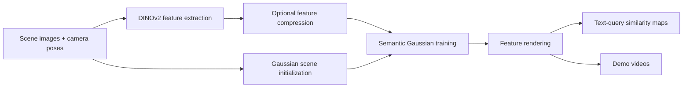

# DinoSplat - 3D Semantic Gaussian Splatting with DINOv2 🦕
***
*Group research project completed during the YSDA × MIPT Studcamp.*
***


**DinoSplat** explores semantic 3D Gaussian Splatting with DINOv2 image features and Talk2DINO-style text alignment. The project modifies a Gaussian Splatting pipeline so that reconstructed Gaussians carry semantic features for feature rendering and natural-language object querying.

The repository contains training, feature extraction, rendering, query, autoencoder, and video-export scripts, plus saved visual artifacts from the project experiments.

## Results and Artifacts

| Result | Outcome |
| --- | --- |
| Feature preprocessing | >50× faster than the SAM-based LangSplat stage |
| Dimensionality reduction | ~10× faster with PCA in the project setup |
| Text-driven querying | Talk2DINO-style text alignment over rendered semantic features |

| Artifact | Description |
| --- | --- |
| `assets/dino_autoenc/output.mp4` | Autoencoder-compressed DINO feature rendering demo |
| `assets/dino_pca/output.mp4` | PCA-compressed DINO feature rendering demo |
| `assets/talk2dino_color/output.mp4` | Talk2DINO color/query visualization demo |
| `assets/talk2dino_few_objects/output.mp4` | Talk2DINO few-object visualization demo |
| `DinoSplat/assets/teaser.png` | Large local teaser image |

## Overview

**Gaussian Splatting** is a real-time scene representation and rendering technique for reconstructing 3D scenes from posed images.

**Semantic 3D Gaussian Splatting** extends this representation by associating semantic features with scene Gaussians. DinoSplat replaces the segmentation-heavy feature preprocessing used in LangSplat-style pipelines with DINOv2 features, then uses Talk2DINO-style CLIP/text alignment for text-driven querying.


**Related Works:**

* *Qin et al. 2023 - LangSplat: 3D Language Gaussian Splatting (CVPR 2024 Highlight)* [arxiv.org/abs/2312.16084](https://arxiv.org/abs/2312.16084)
* *Barsellotti et al. 2024 - Talking to DINO: Bridging Self-Supervised Vision Backbones with Language for Open-Vocabulary Segmentation* [arxiv.org/abs/2411.19331](https://arxiv.org/abs/2411.19331)
* *Kerbl et al. 2023 - 3D Gaussian Splatting for Real-Time Radiance Field Rendering* [repo](https://github.com/graphdeco-inria/gaussian-splatting)


## Method



Scene loading supports COLMAP-style scenes with `sparse/` camera data and Blender/NeRF synthetic scenes with `transforms_train.json`. Feature extraction reads images from `<dataset>/images`, semantic training optimizes Gaussian features, and query rendering saves cosine-similarity maps for text prompts.

## Installation

Set up a Python environment compatible with CUDA and the GraphDECO Gaussian Splatting extensions.

```bash
git clone --recursive https://github.com/berberberk/langsplat-dinov2.git
cd langsplat-dinov2

python3 -m venv .venv
source .venv/bin/activate
python -m pip install --upgrade pip
python -m pip install -r requirements.txt
```

Additional dependencies are required for full training and rendering:

* CUDA-compatible PyTorch.
* `diff_gaussian_rasterization` and `simple_knn`, the CUDA extensions used by the Gaussian renderer.
* COLMAP for converting unordered image folders into posed scenes with `DinoSplat/convert.py`.
* ImageMagick if using `DinoSplat/convert.py --resize`.
* FFmpeg for `render.sh`.
* Internet access or a local torch hub cache for `facebookresearch/dinov2`.
* Compatible Talk2DINO / open-vocabulary segmentation weights and configs for `get_talk2dino_features.py` and `query_gauss.py`.

The repository declares upstream submodules in `.gitmodules` for LangSplat, nerfstudio, Gaussian Splatting, and Talk2DINO.

## Dataset Layout

For the main DinoSplat scripts, use a scene directory with images and camera data:

```text
path/to/scene/
  images/
    00000.png
    00001.png
  sparse/
    0/
      cameras.bin
      images.bin
      points3D.bin
```

Blender/NeRF synthetic scenes are also recognized when `transforms_train.json` is present.

If starting from raw images, `DinoSplat/convert.py` expects input images under `<scene>/input` and writes a COLMAP-style scene:

```bash
cd DinoSplat
python convert.py --source_path /path/to/scene
```

## Usage

Typical pipeline:

```bash
cd DinoSplat

# Extract DINOv2 features.
python preprocess.py --dataset_path /path/to/scene

# Train and apply 3-channel feature compression.
cd autoencoder
python train.py --dataset_path /path/to/scene --dataset_name scene_name
python test.py --dataset_path /path/to/scene --dataset_name scene_name
cd ..

# Train semantic Gaussians.
python train.py \
  --source_path /path/to/scene \
  --model_path /path/to/output/model \
  --start_checkpoint /path/to/rgb/chkpnt30000.pth

# Render semantic features.
python render.py \
  --source_path /path/to/scene \
  --model_path /path/to/output/model \
  --include_feature

# Run a text query.
python query_gauss.py \
  --source_path /path/to/scene \
  --model_path /path/to/output/model \
  --include_feature \
  --text_request "bowl of ramen" \
  --autoencoder_checkpoint /path/to/autoencoder/best_ckpt.pth

# Export rendered PNG frames to MP4.
cd ..
bash render.sh /path/to/rendered/png_frames /path/to/video_output
```

Generated features, rendered arrays, similarity maps, and videos are written under the dataset or model output directories passed to the scripts.

## Project Structure

```text
README.md                         Project overview and usage notes
render.sh                         FFmpeg helper for PNG-to-MP4 export
assets/                           Saved demo videos
DinoSplat/
  preprocess.py                   DINOv2 feature extraction
  get_talk2dino_features.py       Talk2DINO-style feature generation
  train.py                        Gaussian optimization entry point
  render.py                       Offline rendering entry point
  query_gauss.py                  Text-query similarity rendering
  convert.py                      COLMAP scene conversion helper
  arguments/                      CLI parameter groups and defaults
  autoencoder/                    Feature compression model and scripts
  configs/                        Small projection-model configs
  gaussian_renderer/              Gaussian renderer integration
  scene/                          Scene loading and Gaussian model code
  src/                            DINO/Text alignment utilities and copied open-vocabulary segmentation code
  utils/                          Camera, graphics, image, and system helpers
```

## References

* LangSplat: [paper](https://arxiv.org/abs/2312.16084), [repository declared in `.gitmodules`](https://github.com/V1adych/LangSplat.git)
* Talk2DINO: [paper](https://arxiv.org/abs/2411.19331), [repository declared in `.gitmodules`](https://github.com/lorebianchi98/Talk2DINO.git)
* 3D Gaussian Splatting: [repository declared in `.gitmodules`](https://github.com/graphdeco-inria/gaussian-splatting.git)
* DINOv2: `facebookresearch/dinov2`, loaded in `DinoSplat/preprocess.py`
* COLMAP: used by `DinoSplat/convert.py` for camera reconstruction and scene conversion


